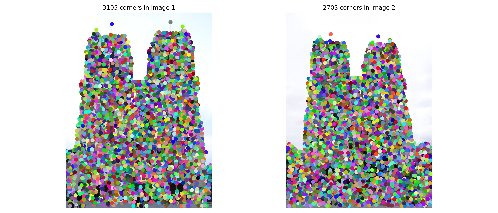

<div align="center">

# 🔧 局部特征匹配
### Local Feature Matching

[](https://github.com/airprofly/featMatch) [](https://github.com/airprofly/featMatch/stargazers) [](https://opensource.org/licenses/MIT)

[](https://www.python.org/downloads/) [](https://pytorch.org/)

Harris 角点检测 · SIFT 描述子 · 特征匹配 · PyTorch · 计算机视觉

</div>

---

## 📖 项目简介

本项目是 **CS 4476 计算机视觉课程 Project 2** 的完整实现，使用 **PyTorch** 从零构建局部特征匹配流水线：检测 Harris 角点、提取 SIFT 描述子、通过 Lowe 比率测试进行特征匹配，并在三组标准图像对上评估匹配准确率。

## 📌 功能特性

- ✅ **Harris 角点检测** — 图像梯度计算 → 二阶矩矩阵 → 角点响应 → 非极大值抑制（NMS）
- ✅ **SIFT 描述子** — 梯度方向直方图 → 子网格累积 → 128 维特征向量
- ✅ **特征匹配** — 欧氏距离矩阵计算 + Lowe 比率测试（$\tau=0.7$）
- ✅ **可视化输出** — 角点标记、对应圆图、对应连线图
- ✅ **定量评估** — 与 ground truth 对比，统计 Top 1 / Top 10 / Top 25 / Top 50 / Top 100 准确率

## 📁 项目结构

```text
featMatch/
├── configs/               # 🔧 配置管理
│   ├── app_config.py      #   配置数据类（AppConfig / PathConfig / ImagePairConfig）
│   ├── app_config.yml     #   YAML 配置文件（数据路径、实验参数、日志设置）
│   ├── logger_config.py   #   日志配置（loguru + tqdm + 文件轮转）
│   └── plt_config.py      #   绘图配置（matplotlib rcParams）
├── models/                # 📚 模型层（核心算法）
│   ├── harrisNet.py       #   HarrisNet — 角点检测（nn.Sequential 堆叠 5 个自定义层）
│   ├── siftNet.py         #   SIFTNet — 特征描述子（梯度 → 直方图 → 子网格累积）
│   └── feature_match.py   #   特征匹配（欧氏距离矩阵 + Lowe 比率测试）
├── utils/                 # 📝 工具函数
│   └── utils.py           #   图像加载/预处理/可视化/评估
├── data/                  # 💾 输入图像（3 对：Notre Dame、Rushmore、Gaudi）
├── ground_truth/          # 💾 Ground truth 匹配标注（.pkl）
├── tests/                 # ✅ 单元测试
│   ├── test_harris.py     #   Harris 各层测试
│   ├── test_sift.py       #   SIFT 各层测试
│   └── test_feature_match.py # 距离计算与匹配测试
├── outputs/figures/       # 📊 输出可视化结果
├── main.py                # 🚀 主流水线入口
├── environment.yml        # 🔧 Conda 环境配置
└── requirements.txt       # 🔧 pip 依赖
```

## 🔧 环境配置

<details>
<summary><b>查看环境配置</b></summary>

### 前置要求
- 安装 [Miniconda](https://docs.conda.io/en/latest/miniconda.html)

### 创建虚拟环境

```bash
# 方式一：使用 Conda（推荐）
conda env create -f environment.yml
conda activate pytorch

# 方式二：使用 pip
conda create -n pytorch python=3.12
conda activate pytorch
pip install -r requirements.txt
```

</details>

## 🚀 快速开始

```bash
# 克隆仓库
git clone https://github.com/airprofly/featMatch.git
cd featMatch

# 运行完整流水线
python main.py
```

程序将依次执行：图像加载 → Harris 角点检测 → SIFT 描述子提取 → 特征匹配 → 可视化 → 评估，结果保存在 `outputs/figures/` 目录。

### 自定义配置

编辑 [configs/app_config.yml](configs/app_config.yml) 可调整：

| 参数 | 默认值 | 说明 |
|------|--------|------|
| `scale_factor` | `0.5` | 图像缩放因子 |
| `num_points` | `4500` | 最大角点数 |
| `num_vis` | `100` | 可视化匹配点数 |

### 运行测试

```bash
pytest tests/ -v
```

## 📊 效果展示

### 角点检测

<a href="outputs/figures/interest_points.jpg" target="_blank">
  
</a>

### 对应圆可视化

<a href="outputs/figures/vis_circles.jpg" target="_blank">
  
</a>

### 对应连线可视化

<a href="outputs/figures/vis_lines.jpg" target="_blank">
  
</a>

### 评估结果

<a href="outputs/figures/eval.jpg" target="_blank">
  
</a>

## 📚 核心算法

### Harris 角点检测

$$
R = \det(M) - \alpha \cdot \operatorname{trace}(M)^2
$$

其中 $M$ 为二阶矩矩阵：

$$
M = \begin{bmatrix} S_{xx} & S_{xy} \\ S_{xy} & S_{yy} \end{bmatrix}
$$

实现采用 5 层 `nn.Sequential` 流水线：
1. `ImageGradientsLayer` — Sobel 算子计算 $I_x, I_y$
2. `ChannelProductLayer` — 计算 $I_{xx}, I_{yy}, I_{xy}$
3. `SecondMomentMatrixLayer` — 高斯加权求和得到 $S_{xx}, S_{yy}, S_{xy}$
4. `CornerResponseLayer` — 计算角点响应 $R$
5. `NMSLayer` — 非极大值抑制保留局部最大值

### SIFT 描述子

1. 计算每个像素的梯度幅值和方向
2. 将方向量化为 8 个 bins，构建加权直方图
3. 在 $4 \times 4$ 子网格上累积直方图，生成 $4 \times 4 \times 8 = 128$ 维特征向量

### 特征匹配

使用 Lowe 比率测试：

$$
\text{match if } \frac{d_{1st}}{d_{2nd}} < \tau \quad (\tau = 0.7)
$$

## 📄 许可证

本项目采用 [MIT 许可证](https://opensource.org/licenses/MIT)。
